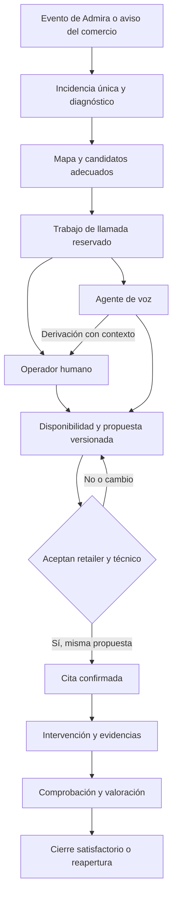

# Yokup /llamadas — coordinación IoT con IA y operadores humanos

Fecha: 15 de septiembre de 2026. Misión: **Hoy #34**, `DCL-c756e5e241db1f402845bcf6`. Proyecto: `yokup`. Responsable del alta y definición: OraculoMacMini.

## Petición y estado

Carlos solicita convertir el flujo de gestión IoT 360 en una misión y desarrollar el generador de llamadas en **https://www.yokup.com/llamadas**, con la opción paralela de realizar las llamadas mediante humanos.

Este documento define el desarrollo. La creación de la misión no acredita una página /llamadas publicada, telefonía conectada ni llamadas realizadas. Las tareas de implementación y piloto permanecen pendientes.

La modalidad humana es una opción disponible desde el inicio, además de una vía de escalado. Un operador puede gestionar toda la conversación sin utilizar un agente de voz. Ambas modalidades usan el mismo expediente, agenda, permisos y resultados.

## Resultado esperado

Coordinar un circuito, sus establecimientos, sus dispositivos y los profesionales que los mantienen: pantallas, audio, conectividad, climatización y seguridad. Vincular cada llamada a un objetivo verificable dentro de una incidencia: confirmar el fallo, obtener disponibilidad, proponer una intervención, acordar cambios o verificar satisfacción.

El mapa operativo queda quieto por defecto. Un evento autorizado puede centrarlo y acercarlo a una incidencia; mientras alguien trabaja sobre otra, los nuevos eventos permanecen en una cola por prioridad y no le cambian la vista. Los datos operativos, ubicaciones sensibles y contactos se muestran solo dentro de sesión y según permisos.

## Tareas de la misión

| Código | Entrega | Criterio de finalización |
|---|---|---|
| a | Alcance, arquitectura y aceptación | Definición persistida, fuentes enlazadas y tarea documentada. |
| b | Centro /llamadas con modalidades humana e IA | Cola, reserva exclusiva, llamadas, contexto, resultados, permisos y recuperación de fallos verificados. |
| c | Integración IoT, mapa, citas y piloto completo | Un caso recorre detección, contacto, asignación, cita, reparación, conformidad y eventual reapertura con evidencia. |

## Pantalla /llamadas

Mantener fondo blanco, tipografías y paleta de los portales Yokup. Mostrar una cola de llamadas pendientes, en curso, para reintentar y finalizadas, filtrable por circuito, establecimiento, prioridad, responsable y modalidad.

Al abrir una llamada: ficha de la incidencia, equipo y diagnóstico, destinatario autorizado, idioma, horario local, objetivo, guion orientativo, propuestas de fecha y cronología. Acciones previstas: asignar a humano, asignar a IA, iniciar, registrar resultado, programar reintento, derivar y abrir el expediente/mapa.

El superusuario administra y reasigna. Los operadores humanos tienen un permiso específico limitado a sus circuitos; no reciben por defecto privilegios de superusuario. Retailers e instaladores consultan sus citas, incidencias y acuerdos correspondientes.

## Modalidad humana

- El operador toma un trabajo de llamada y recibe una reserva exclusiva con vencimiento y renovación mientras exista actividad real.
- Puede llamar desde el navegador con telefonía configurada o usar su teléfono mediante un enlace `tel:`. Este último abre el marcador: no confirma que la llamada haya conectado.
- Ve el mismo contexto que la IA, pero la conversación la realiza la persona. Introduce disponibilidad, notas y resultado estructurado, y puede proponer una fecha.
- La cita usa las mismas validaciones y doble aceptación que el flujo de IA. El botón de llamada o el fin de una comunicación no confirman un acuerdo.
- En una derivación, recibe resumen, propósito pendiente y acuerdos existentes. La transferencia de una llamada en directo requiere soporte del proveedor; si no está disponible, se crea una devolución de llamada, identificada como tal.

## Modalidad IA y telefonía

Propuesta inicial: Twilio Programmable Voice para telefonía saliente y recepción de estados, puente de audio bidireccional y voz en tiempo real de OpenAI. Mantener el adaptador del proveedor separado de las reglas del expediente.

El agente se identifica como asistente virtual de Yokup y usa el idioma del destinatario. Consulta disponibilidad real, recoge alternativas y comunica únicamente propuestas válidas. Solicitudes de atención humana generan derivación con contexto.

La configuración debe mostrar si faltan número autorizado, credenciales o permisos de salida. Credenciales solo en backend/bóveda. No simular llamadas, conexiones o citas cuando la integración esté desactivada. Antes de activar el piloto real, fijar circuitos, contactos autorizados de prueba, horarios, límites de reintentos, duración y gasto. La grabación de audio no es necesaria para la primera entrega; retención y acceso a resúmenes y datos personales se configuran expresamente.

Fuentes técnicas para la propuesta:

- [Twilio Call resource](https://www.twilio.com/docs/voice/api/call-resource).
- [Twilio Media Streams](https://www.twilio.com/docs/voice/media-streams).
- [OpenAI: voz en tiempo real](https://developers.openai.com/api/docs/models/gpt-realtime).

## Estado compartido y concurrencia

Modelo propuesto: `call_jobs` para el objetivo de contacto, `call_attempts` para cada intento, `call_events` para eventos auditables y `intervention_proposals` para citas versionadas. Nombres propuestos, todavía no migraciones implementadas.

Separar estados de telefonía —iniciado, sonando, conectado, finalizado, ocupado, fallido— de resultados de negocio —disponibilidad recogida, propuesta aceptada/rechazada, derivación, sin acuerdo o no localizado—.

Reservar el trabajo de forma atómica antes de iniciar un intento. La exclusión incluye humano e IA. Firmar y validar webhooks, deduplicar eventos por identificador del proveedor y no reintentar una marcación incierta hasta reconciliar su estado. Si se pierde una reserva con una llamada activa, reconciliar antes de permitir otra: el vencimiento por sí solo no autoriza una llamada duplicada.

Toda acción guarda actor, modalidad, circuito, incidencia, intento, fecha y resultado. Los reintentos se procesan con una cola persistente y horario local; no dependen de una sesión de agente abierta. Los textos de una conversación se tratan como datos, nunca como permiso para ampliar acceso o ejecutar acciones fuera del expediente.

## Matching y acuerdo de intervención

1. Normalizar eventos Admira y deduplicar avisos del mismo episodio. Correlacionar fallos de red que afectan a varios dispositivos.
2. Buscar inicialmente dentro de 40 km, filtrando especialidad, disponibilidad y habilitaciones. Ordenar candidatos por tiempo de llegada y adecuación al trabajo. Si no hay cobertura, escalar o ampliar radio según política del circuito; no hacerlo silenciosamente.
3. Contactar al retailer y recoger ventanas viables y persona de acceso al establecimiento.
4. Construir una propuesta con técnico, fecha y zona horaria, duración prevista, alcance y condiciones económicas autorizadas. Reservar disponibilidad temporalmente.
5. Confirmar solo con aceptación retailer+técnico de la misma versión. Cambiar fecha, alcance o precio invalida las aceptaciones afectadas. La ausencia de respuesta no equivale a aceptación.
6. Registrar llegada, trabajo y evidencia. Comprobar recuperación desde Admira cuando exista telemetría y recoger conformidad del comercio. Mantener separadas resolución técnica, valoración y cierre satisfactorio.

## API, MCP e integración existente

Implementar primero las reglas en backend; los portales y las herramientas MCP usan las mismas operaciones. Herramientas candidatas: consultar trabajos de llamada, reservar uno, buscar candidatos, consultar disponibilidad, crear propuesta, registrar aceptación, programar reintento y derivar a un humano. Son contratos propuestos, no herramientas ya publicadas.

La documentación puede ser pública; los contactos, llamadas y cambios requieren autenticación y permisos por función y circuito. El agente nunca decide por sí mismo su autorización.

Reutilizar las incidencias y contratos de los portales existentes. Referencias: [integración de circuitos](integracion-circuitos-mantenimiento.md), [portal retailer](retailer-portal.md), [portal instalador](installer-portal.md), [acceso y superusuario](portal-access-admin.md), [MCP de portales](portal-mcp.md).

Trabajo relacionado consultado: `FLT-100465`, escalado humano encargado a Woz dentro de la gestión IoT. Esta misión concentra el desarrollo de /llamadas y la operación humana de llamadas. Antes de implementar, contrastar entregas relacionadas para reutilizar el contrato de escalado. No se ha enviado un encargo nuevo a otros agentes.

## Pruebas de aceptación del piloto

- Un humano puede completar el contacto y acordar una cita sin un agente de voz.
- La IA puede gestionar el mismo objetivo y pasar el contexto a un operador.
- Dos operadores, o humano e IA a la vez, no pueden iniciar el mismo trabajo reservado.
- Reinicios, callbacks repetidos o pérdida de respuesta no generan otra llamada ni otra cita.
- Ocupado, buzón, rechazo y sin respuesta quedan diferenciados y no confirman una intervención.
- Disponibilidad incompatible, cambio de franja o cancelación regeneran la propuesta y sus aceptaciones.
- El acceso cruzado entre retailers/circuitos y las herramientas fuera de permiso se rechazan.
- El mapa enfoca la incidencia sin interrumpir otra gestión activa.
- El caso completo queda trazado hasta conformidad, valoración o reapertura.

La tarea a termina con esta definición. Las tareas b y c solo se darán por hechas con implementación, pruebas y evidencia del resultado; registrar esta misión no inicia llamadas externas ni acredita un servicio telefónico operativo.
